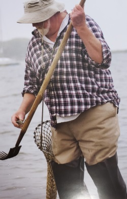
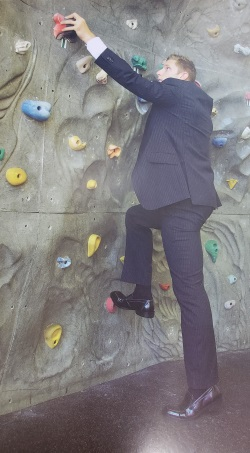

# ProDevStory
## Resume
<a href="MMorganResume.docx" download>Click to Download Resume</a>
## Week 1
Today is the first day of writing this. We had to pick a ProDev buddy using the free market strategy.
I need to make sure that I put some focus into networking while I am in the bootcamp or I risk having
a harder time getting a job after the bootcamp. 

* Quantative accomplishments:
    - I have exercised 8 of the last 10 days 
    - During that time I have lost 2.5 pounds in that time.
    - I have lived in a dirrent country entirely on my own for 9 months.

* Qualitative Features:
    - I have a good work etic, but that can lead to sometimes overworking myself.
    - I have very good attention to detail, especially when it comes to coding, but this mean that I sometimes
      get lost in the minute details rather than looking at grand scope of what I am working on and can lose
      focus on it.
    - Similarly with the second point, I am very much a perfectionist when it comes to coding. This can lead
      to me being frustrated and overwokring on one part of project for too long and losing time for the
      overall project.

* Passion Project
    - I of my biggest hobbies is playing videogames. For someone like me, videogames can somtimes be a release, 
      but they can also be a way to challenge both my logical brain and my creative brain. For example,
      I play a lot of puzzles games. This is very straightforward in how that helps my logical brain, but it 
      also helps my creative brain as well. Sometimes, even puzzles have creative and unique ways that they can 
      be solved, which helps the creative side of my brain. Another thing I like to do with videogames is 
      actually try to break them. Not physically obviously, but push the software in such a way that it breaks.
      Games rarely break in the way that you would think and it is very helpful to my creative brain just think
      of ways to do this. Once I do break it, I can use my logical brain to determine why it broke.
      
* Golden Circle/Bullseye
    - [Golden Circle](GoldenCircleMM.PNG)
      
* Elevator pitch
    - Hello, my name is Matthew. I am trying to get a software development job at this company that expand my
      skillset. I am currently doing a Java and Android bootcamp to help refine the skill I already have. Do you
      have any job opportunities?
      
      
### Weekly Reflection (9/24 - 9/28)

Overall, I think this week was a great step forward for me in really developing myself as a marketable person in
the software development job market. I'm not the greatest public speaker, so I really liked how we are being forced
into those situations to really get that practice. I can't really think of anything negative in terms of what we
learned and did this week in regards to ProDev work. I look forward to to learning more next week.

## Week 2
* Burner Assignment
    - [Burner](Burner.PNG)
    
* Non-Profit: Homeless Animal Rescue Team of New Mexico - (HARTNM)
    - Carolyn Taylor
    - Phone: (505-463-0010) E-mail: carolyntaylor@att.net
    - [HARTNM Website](https://www.hartnm.com/)
    - I selected this non-profit because of their work with helping animals that need it the most. I also believe that
      I could help them reach more people and grow the number of animals they could help by improving their website and
      possibly builing an app for them.
    - The woman that runs this charity is a family friend so it phone or in-person meeting would be the easiest means of
      contact.
 
 * For-Profit: Magokoro Japanese Restaurant
    - Takako Bowen
    - Phone: (505-830-2061)
    - [Magokoro Website](http://magokoroabq.com/)
    - This is one of my favorite restaurants in Albuquerque and I think that I could help expand their customer base
      by developiung an app to make it easier to order food from them as it is almost always packed during lunch and
      dinner.
    - As someone who frequents it reguarly, I would probably just go in and talk about it with the owner.
    
* Salary Expectations
    - Before beginning the bootcamp, I thought that after the bootcamp, I would probably make around 50k once I was
      done. I still do think that to be a realistic goal, but maybe not immediately after I have completed the bootcamp.
      I think a better option would be to go into an internship/apprenticeship type position to be less of a liability
      for the company initially and prove myself first before getting an entry level position somewhere.
      
 ### Weekly Reflection (10/1 - 10/5)
 
 This week was a little bit more relaxed in terms of professional development and more focused on planning for the future.
 A lot of this came down want I want for myself after the bootcamp, including having to research two different places I
 would consider providing my services to. I will say it was much more difficult to find contact information for certain 
 places than others, but some friends-of-family connections, did make it slightly easier. Overall, a nice week to help
 develop my plans post-bootcamp.

## Week 3
### Visual Speaks Activity

* Represents me still trying to find what I want and the skills that I need to really start off my career as a 
software developer.

* Represents me having a decent job three years down the line, but still trying to climb to bigger and better 
places in the software development job market.

* To bridge the gap between the two career statuses, I will first be finishing the bootcamp that I am currently in
and the proceed into finding the first job to get my foot in the door. Once I do have my foot in the door, I will 
continue to hone and refine my skills as a developer in that job and hopefully move from entry level to a 
higher position within a company. From there, I hope to still be climbing up into new and more skilled positions
with new companies, hopefully with great ideas for the future of technology. 
